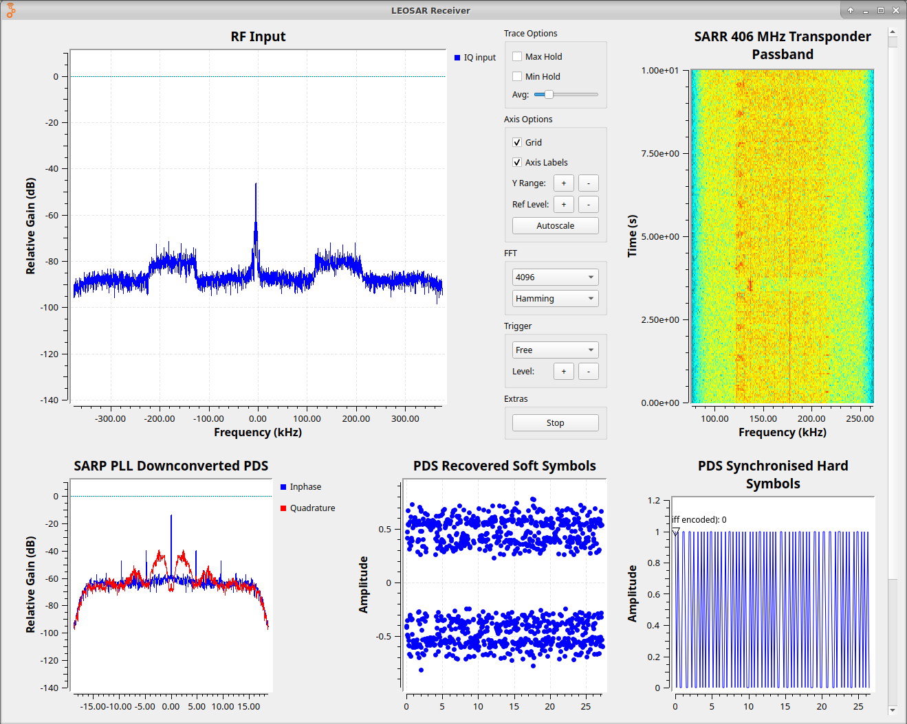
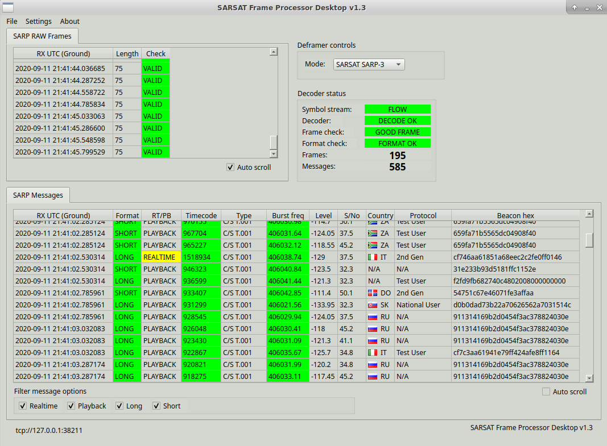
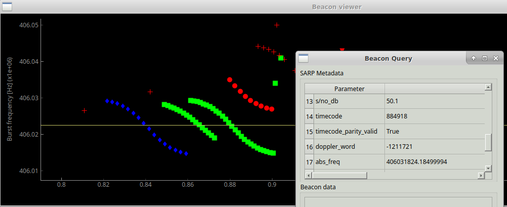

# open-sarp

GNU Radio based LEOSAR Telemetry Processor

## GNU Radio application



PDF of the block diagram [here](doc/sarp_decoder_flowgraph.pdf).




## Doppler viewer

The decoder features a live Doppler-viewer showing the decoded Doppler words from the SARP-messages.
Beacon data can be queried by selecting a sample on the plot.



## Requirements

### Flowgraph
GNU Radio v3.8

### Processing application
```python
pip3 install -r requirements.txt
```


## Running

Customize the GNU Radio flowgraph to suit your RF acquisition setup.

Run the flowgraph after generating it:
```python
python3 src/grc/top_block.py
```

Start the processor application:
```
cd src/processor
python3 process_live.py
```

[countries.json file courtesy of Michael Fazio @ MIDs](https://github.com/michaeljfazio/MIDs)
[Flags courtesy of Steven Skelton @ flag-icon](https://github.com/stevenrskelton/flag-icon/)
